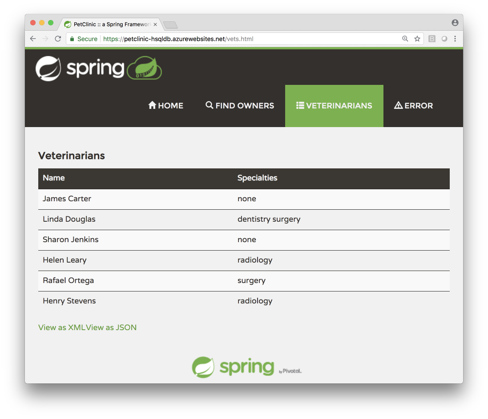
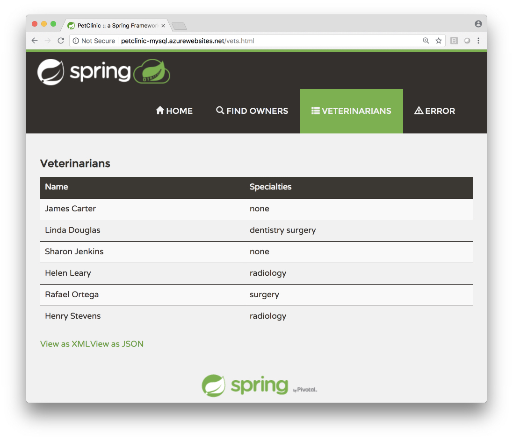

# End-to-end Java Experience in App Service Linux 

This guide walks you through the process of building, 
configuring, deploying, trouble shooting and scaling 
Java Web apps in App Service Linux. 

## What you will build

You will build a Java Web app using Spring Framework, 
JSP, Spring Data, Hibernate, JDBC, App Service Linux and
Azure Database for MySQL.

## What you will need

In order to deploy a Java Web app to cloud, you need 
an Azure subscription. If you do not already have an Azure 
subscription, you can activate your 
[MSDN subscriber benefits](https://azure.microsoft.com/pricing/member-offers/msdn-benefits-details/) 
or sign up for a 
[free Azure account]((https://azure.microsoft.com/pricing/free-trial/)).

In addition, you will need the following:

| [Azure CLI](http://docs.microsoft.com/cli/azure/overview) 
| [Java 8](http://java.oracle.com/) 
| [Maven 3](http://maven.apache.org/) 
| [Git](https://github.com/) 
| [Tomcat](https://tomcat.apache.org/download-80.cgi)
| [MySQL CLI](http://dev.mysql.com/downloads/mysql/) |

## Getting Started

You can start from scratch and complete each step, or 
you can bypass basic setup steps that you are already 
familiar with. Either way, you will end up with working code.

When you are finished, you can check your results 
against YOUR code in 
[e2e-java-experience-in-app-service-linux/complete](https://github.com/Azure-Samples/e2e-java-experience-in-app-service-linux/tree/master/complete).

You can start from [e2e-java-experience-in-app-service-linux/initial-hsqldb](https://github.com/Azure-Samples/e2e-java-experience-in-app-service-linux/tree/master/initial-hsqldb).
Or, you can clone from [spring-framework-petclinic](https://github.com/spring-petclinic/spring-framework-petclinic) 

If you are starting from scratch, you can scaffold a Web app using 
[Maven Web app archetype](https://maven.apache.org/archetypes/maven-archetype-webapp/)
or [start.spring.io](https://start.spring.io/).

#### Step ONE - Clone and Prep

```bash
git clone --recurse-submodules https://github.com/Azure-Samples/e2e-java-experience-in-app-service-linux.git
yes | cp -rf .prep/* .
```

## Build and Deploy Pet Clinic Powered Using HSQLDB

Open the [initial-hsqldb/spring-framework-petclinic](https://github.com/Azure-Samples/e2e-java-experience-in-app-service-linux/tree/master/initial-hsqldb)
sample app in your favorite IDE - IntelliJ | Eclipse | VS Code.

#### Build Pet Clinic
   ```bash
cd initial-hsqldb/spring-framework-petclinic

bash-3.2$ mvn package
[INFO] Scanning for projects...
[INFO] 
[INFO] ------------------------------------------------------------------------
[INFO] Building petclinic 5.0.8
[INFO] ------------------------------------------------------------------------
...
...

[INFO] --- maven-war-plugin:2.3:war (default-war) @ spring-petclinic ---
[INFO] Packaging webapp
[INFO] Assembling webapp [spring-petclinic] in [/Users/selvasingh/GitHub/selvasingh/e2e-java-experience-in-app-service-linux/initial-hsqldb/spring-framework-petclinic/target/petclinic]
[INFO] Processing war project
[INFO] Copying webapp resources [/Users/selvasingh/GitHub/selvasingh/e2e-java-experience-in-app-service-linux/initial-hsqldb/spring-framework-petclinic/src/main/webapp]
[INFO] Webapp assembled in [288 msecs]
[INFO] Building war: /Users/selvasingh/GitHub/selvasingh/e2e-java-experience-in-app-service-linux/initial-hsqldb/spring-framework-petclinic/target/petclinic.war
[INFO] ------------------------------------------------------------------------
[INFO] BUILD SUCCESS
[INFO] ------------------------------------------------------------------------
[INFO] Total time: 24.727 s
[INFO] Finished at: 2018-09-02T22:17:02-07:00
[INFO] Final Memory: 91M/848M
[INFO] ------------------------------------------------------------------------

   ```
    
#### Deploy to Local Tomcat

Add local Tomcat configuration to POM.xml and deploy
Pet Clinic to a Tomcat in your local machine: 

```xml
<plugins>

    <!--*************************************************-->
    <!-- Deploy to Tomcat on localhost                   -->
    <!--*************************************************-->
    <plugin>
        <groupId>org.codehaus.cargo</groupId>
        <artifactId>cargo-maven2-plugin</artifactId>
        <version>1.6.7</version>
        <configuration>
            <container>
                <containerId>tomcat8x</containerId>
                <type>installed</type>
                <home>${TOMCAT_HOME}</home>
            </container>
            <configuration>
                <type>existing</type>
                <home>${TOMCAT_HOME}</home>
            </configuration>
            <!-- Deployables configuration -->
            <deployables>
                <deployable>
                    <groupId>${project.groupId}</groupId>
                    <artifactId>${project.artifactId}</artifactId>
                    <type>war</type>
                    <properties>
                        <context>/</context>
                    </properties>
                </deployable>
            </deployables>
        </configuration>
    </plugin>
    ...
    
</plugins>
```
Set environment variables for binding secrets at runtime:

```bash
cp set-env-variables-template.sh .scripts/set-env-variables.sh
```

Modify `.scripts/set-env-variables.sh` and set Azure Resource Group name, 
App Service Web App Name, Azure Region and Tomcat directory in
 the local machine. Then, set environment variables:
 
```bash
source .scripts/set-env-variables.sh
```
 
Deploy to a local Tomcat:

```bash
bash-3.2$ mvn cargo:deploy
[INFO] Scanning for projects...
[INFO] 
[INFO] ------------------------------------------------------------------------
[INFO] Building petclinic 5.0.8
[INFO] ------------------------------------------------------------------------
[INFO] 
[INFO] --- cargo-maven2-plugin:1.6.7:deploy (default-cli) @ spring-petclinic ---
[INFO] [edDeployerDeployMojo] Resolved container artifact org.codehaus.cargo:cargo-core-container-tomcat:jar:1.6.7 for container tomcat8x
[INFO] [stalledLocalDeployer] Deploying [/Users/selvasingh/GitHub/selvasingh/e2e-java-experience-in-app-service-linux/initial-hsqldb/spring-framework-petclinic/target/petclinic.war] to [/Users/selvasingh/apache-tomcat-8.5.29/webapps]...
[INFO] [stalledLocalDeployer] The WAR file has its context set to / and will therefore be deployed as ROOT.war
[INFO] ------------------------------------------------------------------------
[INFO] BUILD SUCCESS
[INFO] ------------------------------------------------------------------------
[INFO] Total time: 1.639 s
[INFO] Finished at: 2018-09-02T22:20:54-07:00
[INFO] Final Memory: 14M/309M
[INFO] ------------------------------------------------------------------------
```
    
#### Start Tomcat

```bash
cd ${TOMCAT_HOME}
./bin/catalina.sh run
```

#### Open Pet Clinic (HSQLDB) running on Local Tomcat

```bash
open http://localhost:8080
```


#### Deploy to App Service Linux 

Add [Maven Plugin for Azure App Service](https://github.com/Microsoft/azure-maven-plugins/blob/develop/azure-webapp-maven-plugin/README.md) configuration to POM.xml and deploy
Pet Clinic to Tomcat in App Service Linux:

```xml    
<plugins> 

    <!--*************************************************-->
    <!-- Deploy to Tomcat in App Service Linux           -->
    <!--*************************************************-->
       
    <plugin>
        <groupId>com.microsoft.azure</groupId>
        <artifactId>azure-webapp-maven-plugin</artifactId>
        <version>1.4.0</version>
        <configuration>
    
            <!-- Web App information -->
            <resourceGroup>${RESOURCEGROUP_NAME}</resourceGroup>
            <appServicePlanName>${WEBAPP_PLAN_NAME}</appServicePlanName>
            <appName>${WEBAPP_NAME}</appName>
            <region>${REGION}</region>
    
            <!-- Java Runtime Stack for Web App on Linux-->
            <linuxRuntime>tomcat 8.5-jre8</linuxRuntime>
    
        </configuration>
    </plugin>
    ...
</plugins>
```

Deploy to Tomcat in App Service Linux:

```bash
// Log into Azure
az login

// Deploy
bash-3.2$ mvn azure-webapp:deploy
[INFO] Scanning for projects...
[INFO] 
[INFO] ------------------------------------------------------------------------
[INFO] Building petclinic 5.0.8
[INFO] ------------------------------------------------------------------------
[INFO] 
[INFO] --- azure-webapp-maven-plugin:1.4.0:deploy (default-cli) @ spring-petclinic ---
[INFO] Authenticate with Azure CLI 2.0
[INFO] Target Web App doesn't exist. Creating a new one...
[INFO] Creating App Service Plan 'petclinic-hsqldb-appservice-plan'...
[INFO] Successfully created App Service Plan.
[INFO] Successfully created Web App.
[INFO] Trying to deploy artifact to petclinic-hsqldb...
[INFO] Deploying the war file...
[INFO] Successfully deployed the artifact to https://petclinic-hsqldb.azurewebsites.net
[INFO] ------------------------------------------------------------------------
[INFO] BUILD SUCCESS
[INFO] ------------------------------------------------------------------------
[INFO] Total time: 03:27 min
[INFO] Finished at: 2018-09-02T22:33:54-07:00
[INFO] Final Memory: 57M/874M
[INFO] ------------------------------------------------------------------------
```

#### Open Pet Clinic running on Tomcat in App Service Linux

```bash
open https://petclinic-hsqldb.azurewebsites.net
```


When you are finished, you can check your results 
against YOUR code in 
[e2e-java-experience-in-app-service-linux/initial-mysql](https://github.com/Azure-Samples/e2e-java-experience-in-app-service-linux/tree/master/initial-mysql).

## Build and Deploy Pet Clinic Powered Using Azure Database for MySQL

Start your next leg of your journey ... change directory:

```bash
cd ../../initial-mysql/spring-framework-petclinic
```

#### Activate MySQL Profile

Activate MySQL profile in POM.xml by moving the 
```xml <activation></activation>``` markup to MySQL profile:

```xml
        <profile>
            <id>MySQL</id>
            <!-- Activate MySQL profile -->
            <activation>
                <activeByDefault>true</activeByDefault>
            </activation>
            ...
        </profile>
``` 

#### Set environment variables for binding secrets at runtime

```bash
cp set-env-variables-template.sh .scripts/set-env-variables.sh
```

Modify `.scripts/set-env-variables.sh` and set Azure Resource Group name, 
App Service Web App Name, Azure Region, Tomcat directory in
 the local machine and MySQL server info. 
 Then, set environment variables:
 
```bash
source .scripts/set-env-variables.sh
```

#### Provision and Configure Pet Clinic DB in Azure Database for MySQL

Provision Pet Clinic DB using Azure CLI and MySQL CLI:

```bash
// create mysql server
az mysql server create --resource-group ${RESOURCEGROUP_NAME} \
 --name ${MYSQL_SERVER_NAME}  --location westus2 \
 --admin-user ${MYSQL_SERVER_ADMIN_LOGIN_NAME} \
 --admin-password ${MYSQL_SERVER_ADMIN_PASSWORD} \
 --sku-name GP_Gen4_2 \
 --ssl-enforcement Disabled \
 --version 5.7

// allow access from Azure resources
az mysql server firewall-rule create --name allAzureIPs \
 --server ${MYSQL_SERVER_NAME} \
 --resource-group ${RESOURCEGROUP_NAME} \
 --start-ip-address 0.0.0.0 --end-ip-address 0.0.0.0

// allow access from your dev machine for testing
az mysql server firewall-rule create --name allAzureIPs \
 --server ${MYSQL_SERVER_NAME} \
 --resource-group ${RESOURCEGROUP_NAME} \
 --start-ip-address <ip-address-of-your-dev-machine> \
 --end-ip-address <ip-address-of-your-dev-machine>

// increase connection timeout
az mysql server configuration set --name wait_timeout \
 --resource-group ${RESOURCEGROUP_NAME} \
 --server ${MYSQL_SERVER_NAME} --value 2147483

// set server timezone
az mysql server configuration set --name time_zone \
 --resource-group ${RESOURCEGROUP_NAME} \
 --server ${MYSQL_SERVER_NAME} --value US/Pacific
 
mysql -u ${MYSQL_SERVER_ADMIN_LOGIN_NAME} \
 -h ${MYSQL_SERVER_FULL_NAME} -P 3306 -p
 
Enter password: 
Welcome to the MySQL monitor.  Commands end with ; or \g.
Your MySQL connection id is 64379
Server version: 5.6.39.0 MySQL Community Server (GPL)

Copyright (c) 2000, 2018, Oracle and/or its affiliates. All rights reserved.

Oracle is a registered trademark of Oracle Corporation and/or its
affiliates. Other names may be trademarks of their respective
owners.

Type 'help;' or '\h' for help. Type '\c' to clear the current input statement.

mysql> CREATE DATABASE ${MYSQL_DATABASE_NAME};
Query OK, 1 row affected (0.10 sec)

mysql> CREATE USER 'root' IDENTIFIED BY '${MYSQL_DATABASE_NAME}';
Query OK, 0 rows affected (0.11 sec)

mysql> GRANT ALL PRIVILEGES ON ${MYSQL_DATABASE_NAME}.* TO 'root';
Query OK, 0 rows affected (1.29 sec)

mysql> quit
Bye
```

#### Setup configuration for binding secrets at runtime instead of compile time

Modify MySQL configuration in POM.xml to 
bind secrets at runtime:

```xml
<profile>
    <id>MySQL</id>
    <activation>
        <activeByDefault>true</activeByDefault>
    </activation>
    <properties>
        <db.script>mysql</db.script>
        <jpa.database>MYSQL</jpa.database>
        <jdbc.driverClassName>com.mysql.jdbc.Driver</jdbc.driverClassName>
        <jdbc.url>jdbc:mysql://${DOLLAR}{MYSQL_SERVER_FULL_NAME}:3306/${DOLLAR}{MYSQL_DATABASE_NAME}?useUnicode=true</jdbc.url>
        <jdbc.username>${DOLLAR}{MYSQL_SERVER_ADMIN_LOGIN_NAME}</jdbc.username>
        <jdbc.password>${DOLLAR}{MYSQL_SERVER_ADMIN_PASSWORD}</jdbc.password>
    </properties>
    ...
</profile>
```

Modify Maven Plugin for Azure App Service configuration in 
POM.xml to bind secrets at runtime:

```xml
<!--*************************************************-->
<!-- Deploy to tomcat in app service linux           -->
<!--*************************************************-->

<plugin>
    <groupId>com.microsoft.azure</groupId>
    <artifactId>azure-webapp-maven-plugin</artifactId>
    <version>1.4.0</version>
    <configuration>

        <!-- Web App information -->
        <resourceGroup>${RESOURCEGROUP_NAME}</resourceGroup>
        <appServicePlanName>${WEBAPP_PLAN_NAME}</appServicePlanName>
        <appName>${WEBAPP_NAME}</appName>
        <region>${REGION}</region>

        <!-- Java Runtime Stack for Web App on Linux-->
        <linuxRuntime>tomcat 8.5-jre8</linuxRuntime>

        <appSettings>
            <property>
                <name>MYSQL_SERVER_FULL_NAME</name>
                <value>${MYSQL_SERVER_FULL_NAME}</value>
            </property>
            <property>
                <name>MYSQL_SERVER_ADMIN_LOGIN_NAME</name>
                <value>${MYSQL_SERVER_ADMIN_LOGIN_NAME}</value>
            </property>
            <property>
                <name>MYSQL_SERVER_ADMIN_PASSWORD</name>
                <value>${MYSQL_SERVER_ADMIN_PASSWORD}</value>
            </property>
            <property>
                <name>MYSQL_DATABASE_NAME</name>
                <value>${MYSQL_DATABASE_NAME}</value>
            </property>
        </appSettings>
    </configuration>
</plugin>
```
#### Build Pet Clinic

```bash
bash-3.2$ mvn package
[INFO] Scanning for projects...
[INFO] 
[INFO] ------------------------------------------------------------------------
[INFO] Building petclinic 5.0.8
[INFO] ------------------------------------------------------------------------
...
...
[INFO] --- maven-war-plugin:2.3:war (default-war) @ spring-petclinic ---
[INFO] Packaging webapp
[INFO] Assembling webapp [spring-petclinic] in [/Users/selvasingh/GitHub/selvasingh/e2e-java-experience-in-app-service-linux/initial-mysql/spring-framework-petclinic/target/petclinic]
[INFO] Processing war project
[INFO] Copying webapp resources [/Users/selvasingh/GitHub/selvasingh/e2e-java-experience-in-app-service-linux/initial-mysql/spring-framework-petclinic/src/main/webapp]
[INFO] Webapp assembled in [540 msecs]
[INFO] Building war: /Users/selvasingh/GitHub/selvasingh/e2e-java-experience-in-app-service-linux/initial-mysql/spring-framework-petclinic/target/petclinic.war
[INFO] ------------------------------------------------------------------------
[INFO] BUILD SUCCESS
[INFO] ------------------------------------------------------------------------
[INFO] Total time: 47.670 s
[INFO] Finished at: 2018-09-03T07:24:07-07:00
[INFO] Final Memory: 87M/585M
[INFO] -----------------------------------------------------------------------
```
#### Deploy to Local Tomcat and Test

Deploy to a local Tomcat:

```bash
bash-3.2$ mvn cargo:deploy
[INFO] Scanning for projects...
[INFO] 
[INFO] ------------------------------------------------------------------------
[INFO] Building petclinic 5.0.8
[INFO] ------------------------------------------------------------------------
[INFO] 
[INFO] --- cargo-maven2-plugin:1.6.7:deploy (default-cli) @ spring-petclinic ---
[INFO] [edDeployerDeployMojo] Resolved container artifact org.codehaus.cargo:cargo-core-container-tomcat:jar:1.6.7 for container tomcat8x
[INFO] [stalledLocalDeployer] Deploying [/Users/selvasingh/GitHub/selvasingh/e2e-java-experience-in-app-service-linux/initial-mysql/spring-framework-petclinic/target/petclinic.war] to [/Users/selvasingh/apache-tomcat-8.5.29/webapps]...
[INFO] [stalledLocalDeployer] The WAR file has its context set to / and will therefore be deployed as ROOT.war
[INFO] ------------------------------------------------------------------------
[INFO] BUILD SUCCESS
[INFO] ------------------------------------------------------------------------
[INFO] Total time: 1.795 s
[INFO] Finished at: 2018-09-03T07:26:27-07:00
[INFO] Final Memory: 17M/437M
[INFO] ------------------------------------------------------------------------
```

Start local Tomcat:

```bash
cd ${TOMCAT_HOME}
./bin/catalina.sh run
```

The Pet Clinic app is now powered using Azure 
Database for MySQL. The app should look the same as before.

#### Deploy to App Service Linux 

Deploy to Tomcat in App Service Linux:

```bash
bash-3.2$ mvn azure-webapp:deploy
[INFO] Scanning for projects...
[INFO] 
[INFO] ------------------------------------------------------------------------
[INFO] Building petclinic 5.0.8
[INFO] ------------------------------------------------------------------------
[INFO] 
[INFO] --- azure-webapp-maven-plugin:1.4.0:deploy (default-cli) @ spring-petclinic ---
[INFO] Authenticate with Azure CLI 2.0
[INFO] Target Web App doesn't exist. Creating a new one...
[INFO] Creating App Service Plan 'petclinic-mysql-appservice-plan'...
[INFO] Successfully created App Service Plan.
[INFO] Successfully created Web App.
[INFO] Trying to deploy artifact to petclinic-mysql...
[INFO] Deploying the war file...
[INFO] Successfully deployed the artifact to https://petclinic-mysql.azurewebsites.net
[INFO] ------------------------------------------------------------------------
[INFO] BUILD SUCCESS
[INFO] ------------------------------------------------------------------------
[INFO] Total time: 03:27 min
[INFO] Finished at: 2018-09-03T07:39:42-07:00
[INFO] Final Memory: 48M/572M
[INFO] ------------------------------------------------------------------------
```

#### Trouble Shoot Pet Clinic on Azure by Viewing Logs

Configure logs for the deployed Java Web 
app in App Service Linux:

```bash
az webapp log config --name ${WEBAPP_NAME} \
 --resource-group ${RESOURCEGROUP_NAME} \
  --web-server-logging filesystem
```

Open Java Web app remote log stream from a local machine:

```bash
az webapp log tail --name ${WEBAPP_NAME} \
 --resource-group ${RESOURCEGROUP_NAME}
 
2018-09-03T14:45:21  Welcome, you are now connected to log-streaming service.

2018-09-03 14:43:44.347 INFO  - Starting container for site
2018-09-03 14:43:44.354 INFO  - docker run -d -p 17101:80 --name petclinic-mysql_2 -e WEBSITE_SITE_NAME=petclinic-mysql -e WEBSITE_AUTH_ENABLED=False -e WEBSITE_ROLE_INSTANCE_ID=0 -e WEBSITE_INSTANCE_ID=4440212f0d71a318f30d6be76de43332336c145d0f11304df4b060a498433702 -e HTTP_LOGGING_ENABLED=1 appsvc/tomcat:8.5-jre8_0000000000  
...
...
2018-09-03T14:45:20.208498228Z INFO  SimpleUrlHandlerMapping - Mapped URL path [/**] onto handler 'org.springframework.web.servlet.resource.DefaultServletHttpRequestHandler#0'
2018-09-03T14:45:20.485989744Z INFO  DispatcherServlet - FrameworkServlet 'dispatcher': initialization completed in 6597 ms
2018-09-03T14:45:20.751742047Z 03-Sep-2018 14:45:20.751 INFO [localhost-startStop-1] org.apache.catalina.startup.HostConfig.deployDirectory Deployment of web application directory [/home/site/wwwroot/webapps/ROOT] has finished in [69,452] ms
2018-09-03T14:45:20.771519969Z 03-Sep-2018 14:45:20.770 INFO [main] org.apache.coyote.AbstractProtocol.start Starting ProtocolHandler ["http-nio-80"]
2018-09-03T14:45:20.829513635Z 03-Sep-2018 14:45:20.829 INFO [main] org.apache.catalina.startup.Catalina.start Server startup in 70243 ms

```

#### Open Pet Clinic running on Tomcat in App Service Linux

```bash
open https://petclinic-mysql.azurewebsites.net
```


When you are finished, you can check your results 
against YOUR code in 
[e2e-java-experience-in-app-service-linux/complete](https://github.com/Azure-Samples/e2e-java-experience-in-app-service-linux/tree/master/complete).

## Scale out the Pet Clinic App

Scale out Java Web app using Azure CLI:

```bash
az appservice plan update --number-of-workers 2 \
   --name ${WEBAPP_PLAN_NAME} \
   --resource-group ${RESOURCEGROUP_NAME}
```

## Congratulations!

Congratulations!! You built and scaled out a Java Web app using Spring Framework, 
JSP, Spring Data, Hibernate, JDBC, App Service Linux and
Azure Database for MySQL.

## Resources

- Link to Java in App Service Linux dev guide (coming soon)
- [Azure for Java Developers](https://docs.microsoft.com/en-us/java/azure/)

---

This project has adopted 
the [Microsoft Open Source Code of Conduct](https://opensource.microsoft.com/codeofconduct/). 
For more information see the [Code of Conduct FAQ](https://opensource.microsoft.com/codeofconduct/faq/) or 
contact [opencode@microsoft.com](mailto:opencode@microsoft.com) 
with any additional 
questions or comments.
